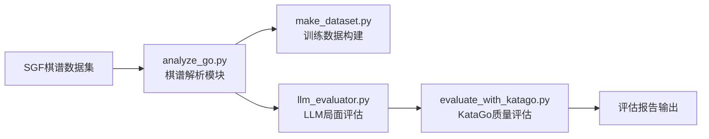
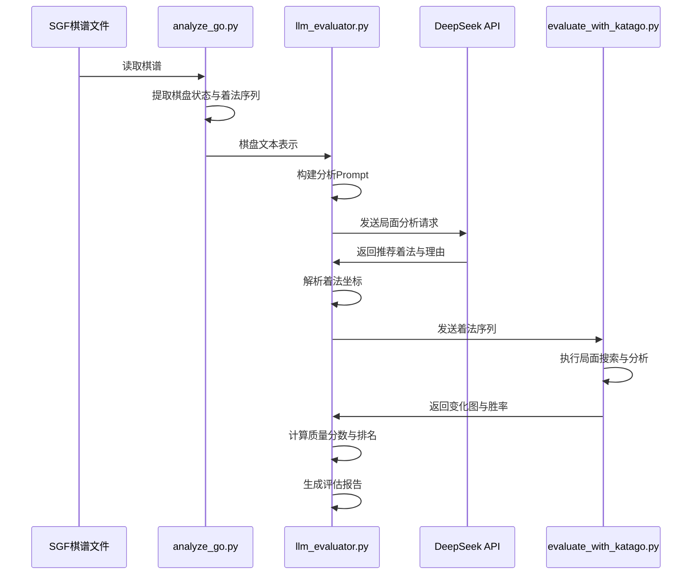

# AI_Go_LLM

## 项目概述

本项目旨在探索大语言模型（Large Language Model, LLM）在围棋对局中的空间推理与决策能力。通过构建完整的评估流水线，将LLM的落子推荐与KataGo等传统围棋AI的分析结果进行系统对比，量化LLM在围棋这一复杂策略领域中的表现水平。

## Phase 0：基础评估流水线

### 目标

Phase 0 的核心目标是搭建一套端到端的评估框架，实现从棋谱数据获取、解析、LLM分析到KataGo质量评估的完整流程。该阶段聚焦于以下四项基础能力：

- **棋谱数据标准化**：建立统一的SGF棋谱解析与数据预处理流程，为后续分析提供规范化的棋盘状态表示
- **训练数据集构建**：从海量棋谱中提取开局信息，生成适合LLM微调的指令数据集
- **LLM局面分析集成**：接入大语言模型（DeepSeek），使其具备围棋局面阅读与着法推荐能力
- **评估基准建立**：引入KataGo作为客观评估基准，量化LLM着法推荐的质量水平

### 模块架构

### 模块说明

#### [`analyze_go.py`](analyze_go.py:1) —— SGF棋谱解析模块

负责解析SGF格式的围棋棋谱文件，提供棋盘状态的提取与多种文本表示。

核心功能：

- **棋盘状态提取**（`extract_board_and_moves`）：从SGF文件中加载指定手数后的完整棋盘状态，同时返回到达该状态的着法序列与下一手玩家信息
- **棋盘文本表示**（`board_to_text`）：支持三种表示模式——矩阵显示（19×19字符网格）、坐标列表（按颜色分组列出所有棋子坐标）、简化统计（黑白棋子数量与空点计数）
- **统计信息获取**（`get_board_statistics`）：返回结构化的棋盘统计数据，包含各颜色棋子的坐标列表与数量
- **坐标规范化**：将内部（row, col）坐标转换为国际通用的GTP格式（字母A-T跳过I，数字1-19）

底层依赖 [`sgfmill`](https://pypi.org/project/sgfmill/) 库进行SGF文件的解析。

#### [`download_dataset.py`](download_dataset.py:1) —— 数据集下载工具

从在线公开仓库批量下载SGF棋谱数据集，自动解压至本地指定目录。用于获取Phase 0评估与训练所需的原始棋谱数据。

#### [`make_dataset.py`](make_dataset.py:1) —— 训练数据集构建

从SGF棋谱文件中提取开局阶段的着法信息，生成适合LLM指令微调的JSONL格式数据集。

处理逻辑：

- 遍历目录中所有SGF文件，提取每局棋的前6手着法
- 将前5手组合为输入上下文，第6手作为预测目标
- 以Alpaca指令微调格式输出，每条数据包含 `instruction`（任务描述）、`input`（开局上下文）、`output`（目标着法）三个字段
- 自动过滤手数不足或解析失败的棋谱文件

#### [`rename_tools.py`](rename_tools.py:1) —— 文件批量重命名

对指定文件夹中的SGF文件进行批量重命名，通过添加统一前缀避免多数据源合并时可能出现的文件名冲突。

#### [`llm_evaluator.py`](llm_evaluator.py:1) —— LLM围棋评估核心

Phase 0 的核心评估模块，串联从棋盘提取到LLM分析再到质量评估的完整流程。

核心功能：

- **LLM客户端初始化**（`init_llm_client`）：基于OpenAI兼容SDK接入DeepSeek API，通过 `.env` 文件管理认证凭证
- **局面评估主流程**（`evaluate_single_position`）：依次执行棋盘状态提取、Prompt构建与发送、LLM回复解析、KataGo质量评估五个子步骤，返回结构化评估结果
- **着法解析**（`parse_move_from_llm_response`）：从LLM的多种回复格式中提取标准围棋坐标。支持JSON结构化输出、中英文自然语言描述、以及PASS（停一手）等多种表达形式
- **理由提取**（`extract_reason_from_response`）：从LLM回复中提取着法推荐的分析理由，优先解析JSON格式，其次匹配常见分析段落模式
- **质量指标计算**：根据LLM推荐着法在KataGo变化图中的排名、胜率、目数优势等维度，综合计算质量分数（0.0–1.0），并给出定性标签（完美匹配/优秀选择/合理选择/可接受/不在推荐列表中）

#### [`evaluate_with_katago.py`](evaluate_with_katago.py:1) —— KataGo引擎封装

封装KataGo围棋AI引擎的GTP通信接口，提供客观的局面分析基准。

核心能力：

- **进程生命周期管理**（`start` / `stop`）：通过子进程方式启动和终止KataGo引擎，支持上下文管理器（`with`语句）自动清理
- **GTP命令通信**（`send_command`）：线程安全的GTP协议命令收发，支持超时控制与跨平台兼容
- **局面分析**（`analyze_position_with_moves`）：根据实际着法序列逐手设置棋盘状态，调用KataGo分析引擎，支持多种分析命令格式的自动适配
- **分析响应解析**（`_parse_analysis_response`）：兼容JSON格式（新版KataGo）与传统文本格式（info行）的响应解析，提取最佳着法、胜率、目数优势、变化图序列等关键信息
- **棋盘状态查询**（`get_board_state`）：通过GTP命令获取当前棋盘上所有棋子的坐标列表

#### 辅助测试脚本

- [`test_sgf.py`](test_sgf.py:1)：验证SGF棋谱解析库的基础功能，包括文件读取、对局元信息提取、手数统计
- [`test_llm.py`](test_llm.py:1)：验证与LLM API的连接状态，确保DeepSeek服务可达且能返回有效回复

### 评估流程

单次局面评估的完整数据流如下：

### 技术栈

| 组件 | 技术方案 | 用途 |
|------|----------|------|
| 编程语言 | Python 3 | 全部模块的实现语言 |
| SGF解析库 | sgfmill | 围棋棋谱文件的读取与解析 |
| LLM接入 | OpenAI SDK | 兼容DeepSeek API的通用大模型调用 |
| LLM服务 | DeepSeek（deepseek-reasoner） | 围棋局面分析与着法推荐 |
| 围棋AI引擎 | KataGo（GTP协议） | 着法质量评估的客观基准 |
| 环境管理 | python-dotenv | 通过 `.env` 文件管理API密钥与路径配置 |
| 数据格式 | JSONL（Alpaca指令格式） | 训练数据集的标准化存储 |

### 环境依赖

项目通过 `.env` 文件管理外部服务与资源的配置信息：

| 环境变量 | 说明 |
|----------|------|
| `DEEPSEEK_API_KEY` | DeepSeek API的认证密钥 |
| `DEEPSEEK_BASE_URL` | DeepSeek API的服务端点URL |
| `KATAGO_PATH` | KataGo可执行文件的本地路径 |
| `KATAGO_CONFIG_PATH` | KataGo GTP配置文件（如 `gtp_example.cfg`）的路径 |
| `KATAGO_MODEL_PATH` | KataGo神经网络模型文件的路径 |
