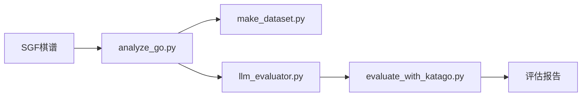

# AI_Go_LLM 

*****探索大语言模型（LLM）在围棋对局中的空间推理与决策能力，通过 KataGo 等传统围棋 AI 作为基准，量化 LLM 着法推荐的质量表现。*****

## Phase 0

### 目标

搭建端到端评估框架，覆盖从棋谱获取、解析、LLM 分析到 KataGo 质量评估的完整链路：

- **棋谱标准化**：统一的 SGF 解析与棋盘状态表示
- **训练数据构建**：从棋谱提取开局信息，生成 LLM 指令微调数据集
- **LLM 集成**：接入 DeepSeek 进行局面分析与着法推荐
- **评估基准**：以 KataGo 为客观参照，量化着法推荐质量

### 模块架构

### 模块说明

| 文件 | 职责 |
|------|------|
| [`analyze_go.py`](analyze_go.py:1) | SGF 棋谱解析，提取棋盘状态与着法序列，支持矩阵/坐标/统计三种文本表示 |
| [`download_dataset.py`](download_dataset.py:1) | 从在线仓库批量下载 SGF 棋谱数据集并解压 |
| [`make_dataset.py`](make_dataset.py:1) | 从棋谱提取前 6 手开局着法，以 Alpaca 格式输出 LLM 微调数据集（JSONL） |
| [`rename_tools.py`](rename_tools.py:1) | 批量重命名 SGF 文件，添加前缀避免多数据源文件名冲突 |
| [`llm_evaluator.py`](llm_evaluator.py:1) | 核心评估模块：初始化 LLM 客户端、构建 Prompt、解析 LLM 回复中的着法与理由、调用 KataGo 计算质量分数 |
| [`evaluate_with_katago.py`](evaluate_with_katago.py:1) | KataGo GTP 引擎封装：进程管理、局面分析、响应解析（兼容 JSON 与 info 行格式） |
| [`test_sgf.py`](test_sgf.py:1) | SGF 解析功能的基础验证 |
| [`test_llm.py`](test_llm.py:1) | LLM API 连接状态验证 |

### 技术栈与环境依赖

| 组件 | 方案 / 环境变量 | 用途 |
|------|----------------|------|
| 语言 | Python 3 | — |
| SGF 解析 | sgfmill | 棋谱读取 |
| LLM 接入 | OpenAI SDK | 调用 DeepSeek API |
| LLM 服务 | DeepSeek (deepseek-v4-pro) | 局面分析与着法推荐 |
| 围棋 AI | KataGo (GTP) | 着法质量基准 |
| 认证 | `DEEPSEEK_API_KEY` | API 密钥 |
| 端点 | `DEEPSEEK_BASE_URL` | API 服务地址 |
| KataGo 路径 | `KATAGO_PATH` | 可执行文件路径 |
| 配置 | `KATAGO_CONFIG` | GTP 配置文件路径 |
| 模型 | `KATAGO_MODEL` | 神经网络模型路径 |
| 环境管理 | python-dotenv | `.env` 文件加载 |
| 数据格式 | JSONL (Alpaca) | 训练数据存储 |
